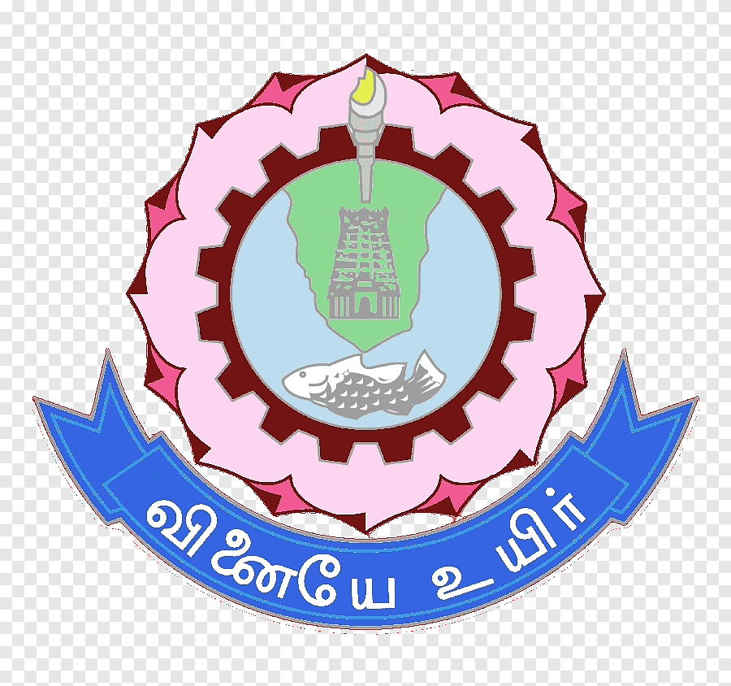
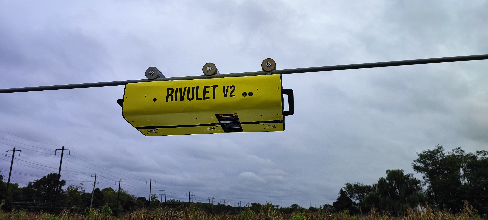
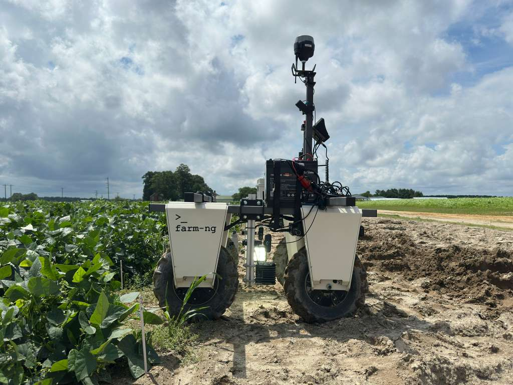
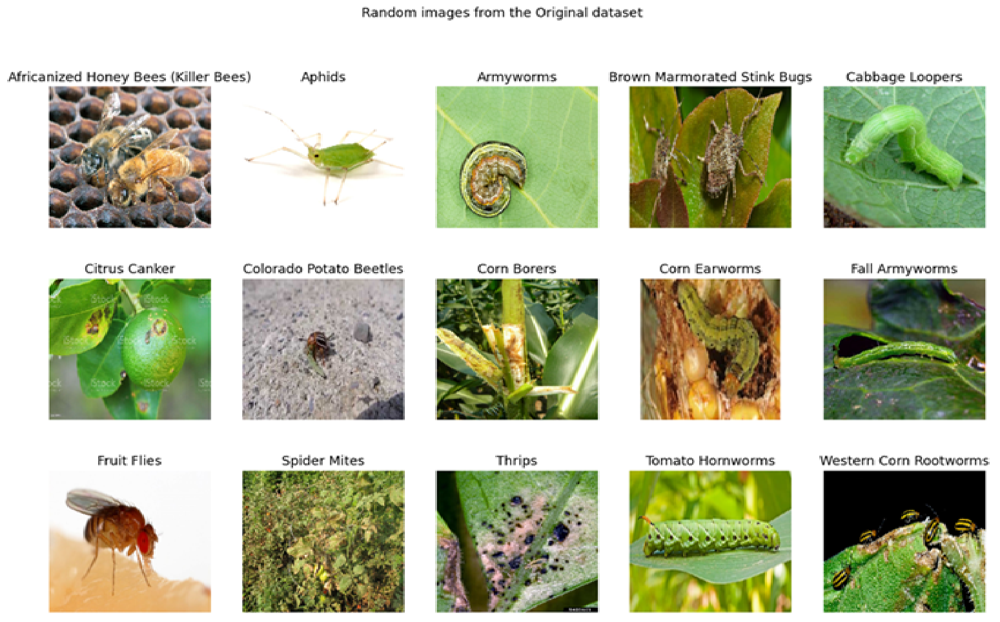

<!-- #################################################################################################################################################################################### -->

<!-- #################################################################################################################################################################################### -->

# Robotics Software Engineer

**👋 Hi, I'm Annamalai Muthupalaniappan!**

I am a robotics software engineer with around 3+ years of experience in delivering innovative solutions through advanced algorithmic development and intelligent system design. I specialize in autonomous navigation, perception, SLAM, and control systems (PID, MPC, LQR) for Mobile and Industrial Robots. My work spans embedded systems and simulation, utilizing ROS/ROS2, Isaac Sim, Gazebo, and Rviz for physics-based modeling, as well as languages such as C++, Python, and MATLAB for development. I focus on sensor fusion (IMUs, LiDAR, GPS) and state estimation (Kalman Filters, EKF/UKF) to enable robust localization and mapping in real-world environments and ensure the path planning for the robot to autonomously navigate in an optimal and efficient way. I am passionate about applying controls and AI (computer vision, deep learning, path planning) to advance intelligent robotic systems.

---
<!-- #################################################################################################################################################################################### -->

### 🚀 Skills & Expertise

**Programming & Libraries:** C++, Python, SQL, MATLAB, OpenCV, Numpy, NetworkX 

**Robotics Frameworks and tools:** ROS, ROS2, Gazebo, Isaac Sim, Rviz

**Control & Estimation:** PID, Kalman Filter (EKF, UKF), SLAM, Trajectory Optimization.

**Sensors & Hardware:** IMUs, Gyroscopes, Accelerometers, LiDAR, GPS/GNSS, NVIDIA Jetson (Nano, Agx Orin, Zed Box), Raspberry Pi, Arduino, Feather M4 CAN, Actuator integration.

**Programming Paradigms & Software**: OOP, Functional Programming, Bash Scriping, CI/CD and Git for version control and automation.

---
<!-- #################################################################################################################################################################################### -->

## 🎓 Education

| **Degree** | **University** | **Logo** | **GPA** | **Year** |
|:-----------:|:---------------:|:--------:|:-----:|:--------:|
| **M.S., Robotics** | **University of Delaware** | **** | **4.0/4.0** | **(_May 2025_)** |
| **B.E., Mechatronics** | **Anna University** | **** | **8.77/10.0** | **(_May 2021_)** |

---
<!-- #################################################################################################################################################################################### -->

## 🛠️ Work Experience
### Research Assistant @ Ag-Cypher Lab, UD, USA | Advisor - [Dr.Yin Bao](https://me.udel.edu/faculty/yin-bao/) | (_June 2024 - Present_)
**Rivulet 2.0: [Github](https://anna02malai.github.io/Rivulet_2_0/)**
- Designed a control system and implemented a finite-state machine integrating motors, sensors, and actuators to teleoperate a mobile gantry system on a center-pivot irrigation rig using ROS framework.
- Integrated MID-360 LiDAR with Fast-LIO SLAM for 3D environmental mapping, obstacle detection (truss pockets), and localization to support autonomous navigation.
- Simulated motion planning for crop coverage using a 2-DOF arm model to generate preliminary results which were accepted by **USDA** for a **$150K** research grant.

**Amiga Bot (Farm-Ng): [Github](https://anna02malai.github.io/Farm_ng_Amiga/)**
- Developed and deployed a ROS 2-based teleoperation pipeline using a Jetson and Feather M4 CAN micro-controller for CAN-bus motor control and fused the MID-360 LiDAR with the robot, applied Fast-LIO for 3D mapping.
- Developed a ROS2 package to convert the maps to 2D occupancy grids and integrated with Nav2 for autonomous SLAM navigation in greenhouse trials, improving navigation accuracy and enabling reliable row-following under GPS-denied conditions.
- Currently extending navigation with GPS way pointing, camera-based object detection, and steering control for precise orchard row-following.

---

### Robotics Software Intern @ Tric Robotics, San Luis Obispo, California | (_Feb 2025 - May 2025_)
- Advisor - **[Dr.Herbert Tanner](https://me.udel.edu/faculty/herbert-tanner/)**
- Developed a graph-based modified A*/TSP algorithm in Python (NetworkX, Shapely, NumPy) to generate obstacle-aware navigation paths from GeoJSON farm data, optimizing robot traversal for constrained fields and boosting operational efficiency by **20%** and treatment rate by **25%**.
- Engineered an automated field-to-graph abstraction framework that converts real-world GPS coordinates into UTM-aligned plots, dynamically models crop rows and obstacles, and computes fuel, time, and labor-cost metrics for mission-level efficiency evaluation.

---

### Graduate Teaching Assistant @ University of Delaware, Newark, DE  |  (_Feb 2024 - May 2025_)
- Subjects: Mechanics of Solids (Advisor - **[Dr.Chelsea Davis](https://me.udel.edu/faculty/chelsea-davis/)**), Introduction to Robotics (Advisor - **[Dr. Panagiotis Artemiadis](https://me.udel.edu/faculty/panagiotis-artemiadis/)**).
- Instructed 80+ undergrad students during discussion and problem sessions and evaluated their homework/assignments on weekly basis. Also assisted the professor with their academic work and activities.

---

### Software Engineer @ Accenture Solutions Pvt Ltd, Chennai, India  |  (_Jun 2021 - Jul 2023_)
- Automated 30% of the web accessibility testing process for websites using WCAG Guidelines and Earned the DHS Trusted Tester for Web Certification from U.S. Department of Homeland Security.
- Trained & mentored 12+ associate software engineers in Python, SQL and Git, reducing project cycle times by 40%.

---
<!-- #################################################################################################################################################################################### -->

## 💡 Projects
### KUKA-LBR iiwa 7 R800 Manipulation [Inverse Kinematics, MATLAB, DH, Motion Planning]:
[Github](https://github.com/Anna02malai/Robotics/tree/main/Intro_to_Robotics)

Simulated and implemented a trajectory for the 7-DOF Kuka robot using Denavit-Hartenberg and inverse kinematics principles to position the end effector inside a prescribed area while accounting for potential singularities and self-collision.

<video width="640" height="360" controls>
  <source src="Files/video/Simulation.mp4" type="video/mp4">
  Your browser does not support the video tag.
</video>

---

### Fire Fighting Robot [C++, Odometry, Path planning, Perception, Encoders, Teleoperation]:
[Github](https://github.com/Anna02malai/Robotics/tree/main/Mechatronics)

Developed an autonomous mobile robot for detecting buildings on fire. I contributed to the design of path planning, telemetry, and control algorithms for the robot. Performed hardware calibration, PCB and wiring checks, and integrated sensor fusion pipelines for odometry.

<video width="640" height="360" controls>
  <source src="Files/video/Final_Showdown.mp4" type="video/mp4">
  Your browser does not support the video tag.
</video>

---

### Path Planning of TurtleBot3 (Burger) [Path Planning, ROS, Navigation stack, ROS2, Nav2, Rviz, Gazebo, Python]:

Integrated and simulated multiple path-planning algorithms (Dijkstra, Greedy BFS, A*, RRT, Artificial Potential Field) into the pre-existing ROS Navigation stack on TurtleBot3, systematically evaluating their performance across diverse simulated environments.

---

### Breast Cancer Prediction [Python, Machine Learning, Binary Classification]:
[Github](https://github.com/Anna02malai/Machine-Learning---Intro/tree/main/Breast_Cancer_Prediction)

Designed a machine learning model that predicts breast cancer using preexisting models such as logistic regression, SVM, KNN, Random forest. Tuned the hyper parameters and analyzed the model's behaviour and its influence in our problem and requirements and made a case study.

---

### Classification of Harmful Insects in Agriculture [Python, Machine Learning, Multi-class Classification]:
[Github](https://github.com/Anna02malai/Machine-Learning---Intro/tree/main/Classification_of_Harmful_Insects_in_Agriculture)

Developed a deep learning–based image classification system using transfer learning models (Xception, InceptionV3, ResNet50V2, etc.) to identify 15 species of harmful agricultural insects from field images. Achieved over 75% test accuracy, enabling early pest detection and precision crop protection for sustainable farming applications.

---

<!-- #################################################################################################################################################################################### -->

## 🎖️ Acheivements

1. Recipient of the **Graduate Teaching Assistant Award** in Mechanical Engineering for the academic year *2023-2024*.

2. Led and represented the University of Delaware’s Team (The Salty Blue Hens) in the **[2025-Farm Robotics Challenge](https://www.farmroboticschallenge.ai/)** and won the **[Judges’ Choice Impact Award](https://www.farmroboticschallenge.ai/2025results/v/universitydelaware)** a cash reward of $2.5K. 

    <video width="640" height="360" controls>
        <source src="Files/video/FRC_2025.mp4" type="video/mp4">
        Your browser does not support the video tag.
    </video>

<!-- #################################################################################################################################################################################### -->

